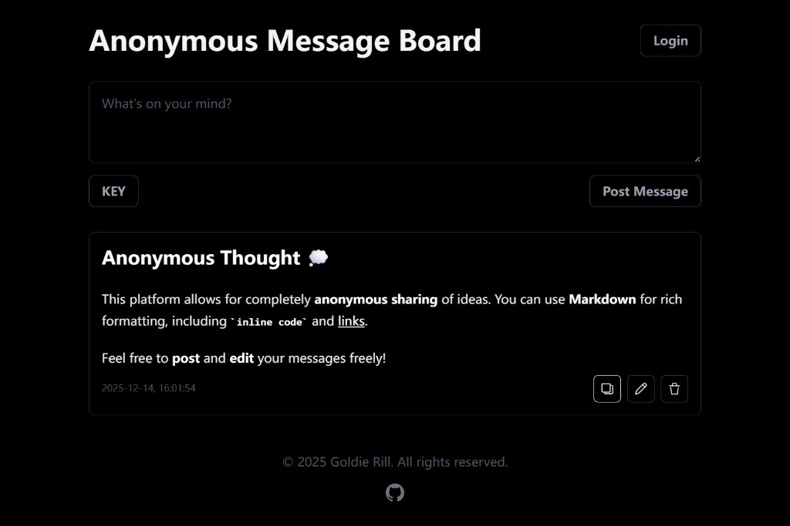

# Anonymous Message Board

A simple, anonymous message board web application built with Node.js, Express, EJS, and SQLite3, containerized using Docker and Docker Compose. This application features a pure dark mode interface, support for Markdown content, and allows users to post, edit, and delete messages anonymously.



## Features

*   **Anonymous Posting**: Share your thoughts without revealing your identity.
*   **Pure Dark Mode**: A sleek, modern dark theme is enforced throughout the application. No theme switching needed.
*   **SQLite3 Database**: Lightweight and efficient data storage.
*   **Data Persistence**: All messages are stored persistently using Docker volumes, ensuring your data is safe across container restarts.
*   **Markdown Support**: Write messages using Markdown syntax (headings, bold, italics, lists, code blocks, etc.), which will be rendered beautifully.
*   **Edit & Delete Messages**: Users can edit their previously posted messages or delete them.
*   **Private Messages with KEY Protection**: Post private messages protected by a KEY. Only users who know the correct KEY can view these messages.
*   **Responsive Design**: The application is designed to be accessible and usable across various devices, with mobile-friendly buttons.
*   **Dockerized Deployment**: Easy setup and deployment using Docker and Docker Compose.

## Tech Stack

*   **Backend**: Node.js (Latest Alpine) with Express.js
*   **Database**: SQLite3
*   **Templating**: EJS
*   **Styling**: Tailwind CSS (configured for `darkMode: 'class'`)
*   **Client-side Logic**: Native JavaScript (Fetch API)
*   **Markdown Rendering**: Showdown.js
*   **Containerization**: Docker, Docker Compose

## Getting Started

These instructions will get you a copy of the project up and running on your local machine.

### Prerequisites

You need to have Docker and Docker Compose installed on your system.

*   [Install Docker](https://docs.docker.com/get-docker/)

### Installation

1.  **Clone the repository:**
    ```bash
    git clone https://github.com/carterwayneskhizeine/AnonymousMessageBoard.git
    cd AnonymousMessageBoard
    ```

2.  **Build and run the application using Docker Compose:**
    ```bash
    docker-compose up --build -d
    ```
    This command will:
    *   Build the Docker image for the `message-board` service based on the `Dockerfile`.
    *   Install all Node.js dependencies, including Tailwind CSS and Showdown.js.
    *   Run the Tailwind CSS build process.
    *   Start the `message-board` container in detached mode (`-d`).
    *   Map port `1989` from your host to the container.
    *   Mount a local `./data` directory to `/app/data` inside the container for SQLite database persistence.

### Accessing the Application

Once the Docker containers are up and running, open your web browser and navigate to:

[http://localhost:1989](http://localhost:1989)

## Usage

### Public Messages
*   **Post a Message**: Type your message (you can use Markdown!) in the text area and click "Post Message".
*   **Edit a Message**: Click the blue "Edit" button next to a message. An edit box will appear pre-filled with the message's original Markdown content. Make your changes and click "Save".
*   **Delete a Message**: Click the red "Delete" button next to a message. Confirm your action to remove the message.

### Private Messages
*   **Post a Private Message**:
    1. Type your message in the text area
    2. Click "Post Message"
    3. In the popup dialog, select "Private Message"
    4. Enter a KEY (any text or symbols) for your private message
    5. Click "Confirm" to send
    *Note: Private messages are not immediately visible after posting*

*   **View Private Messages**:
    1. Click the dark blue "KEY" button below the message input area
    2. A KEY input field will appear between the KEY button and Post Message button
    3. Enter the correct KEY for the private messages you want to view
    4. Click the blue "Send" button or press Enter
    5. Matching private messages will appear above all public messages, marked with private

*   **Hide Private Messages**:
    *   Click the "KEY" button again to hide the input field and clear the KEY
    *   Refresh the page - private messages are automatically hidden on page refresh
    *   Private messages require re-entering the KEY to view again

### Markdown Examples

You can use standard Markdown syntax in your messages, for example:

```markdown
# My Awesome Message

Hello **world**! This is a *great* message.

- Item One
- Item Two
  - Sub-item
```


## Database Migration

This project uses SQLite for its database, which stores all data in a single file named `messages.db`. This file is persisted on your host machine in the `./data/` directory, thanks to a Docker volume. Migrating your messages to another Docker device is straightforward:

1.  **On the Source Device**: Locate the `data/messages.db` file within your project directory.
2.  **Transfer the File**: Copy this `messages.db` file to your new device using your preferred method (e.g., `scp`, USB drive, cloud storage).
3.  **On the New Device**: Place the copied `messages.db` file into the `data/` directory of your project on the new device. Ensure it replaces any existing `messages.db` file if you want to use the old data.
4.  **Start the Application**: Run `docker-compose up -d` on the new device. Your application will automatically use the migrated database, and all your messages will be available.

## Project Structure

*   `./data/`: Contains the `messages.db` SQLite database file (persisted via Docker volume).
*   `./public/`: Static assets (CSS, client-side JS).
    *   `public/js/main.js`: Main client-side script for dynamic interactions (modified to support private messages).
    *   `public/style.css`: Compiled Tailwind CSS output.
*   `./src/`: Server-side source code and input CSS.
    *   `src/index.js`: Express.js backend server (modified to support private messages API).
    *   `src/input.css`: Tailwind CSS input file.
*   `./views/`: EJS template files.
    *   `views/index.ejs`: Main application layout (modified to add KEY button, input field, and modal dialog).
*   `Dockerfile`: Defines the Docker image build process.
*   `docker-compose.yml`: Defines the services, networks, and volumes for Docker Compose.
*   `package.json`: Node.js project metadata and dependencies.
*   `tailwind.config.js`: Tailwind CSS configuration.
*   `.gitignore`: Specifies intentionally untracked files to ignore.

### Key Modifications for Private Messages Feature

The following files were modified to implement the private messages feature:

1. **`src/index.js`**:
   - Added `is_private` and `private_key` columns to the `messages` table
   - Modified `POST /api/messages` to accept `isPrivate` and `privateKey` parameters
   - Modified `GET /api/messages` to support `privateKey` query parameter
   - Updated root route to only show public messages

2. **`views/index.ejs`**:
   - Added dark blue "KEY" button below message input
   - Added KEY input field and blue "Send" button (hidden by default)
   - Added modal dialog for message type selection (Public/Private)
   - Added error message display area

3. **`public/js/main.js`**:
   - Added event listeners for KEY button, Send button, and modal dialog
   - Modified message posting flow to show type selection dialog
   - Updated message loading to filter by private KEY
   - Added error handling for invalid KEY input

## Development

If you make changes to the code, especially to `package.json`, `src/index.js`, `public/js/main.js`, `src/input.css`, `tailwind.config.js`, or the `Dockerfile`, you will need to rebuild the Docker image to apply these changes:

```bash
docker-compose up --build -d
```

This ensures that any new dependencies are installed, CSS is recompiled, and your latest code is included in the running container.

### Database Migration for Private Messages

When upgrading from a previous version without private messages support, the database will be automatically migrated to include the new `is_private` and `private_key` columns. All existing messages will be marked as public (`is_private = 0`).

## License

This project is licensed under the [WTFPL](LICENSE) - see the LICENSE file for details.

---
Built by Love.
